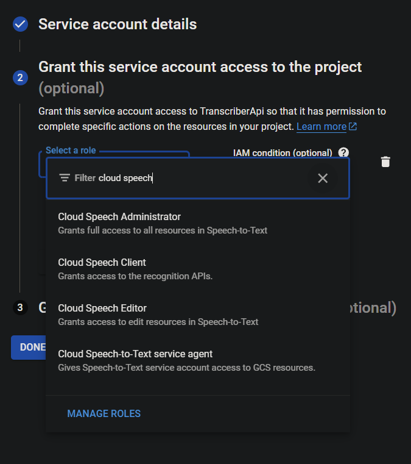

# Transcriber

A .NET 8 console app to play with the Google Cloud Speech-to-Text API.

# Pre-requisites
- .NET 8 SDK
- A Google Cloud account with the Speech-to-Text API enabled

# Google Cloud Setup
Undetailed steps to point you in the right direction to set up Google Cloud for this app:

1. Create a Google Cloud Platform project
2. and enable the [Speech-to-Text API](https://docs.cloud.google.com/speech-to-text/docs).
3. Create a [service account](https://docs.cloud.google.com/iam/docs/service-account-overview)
4. Ensure the service account has a role with permission to use the Speech-to-Text API (e.g., `Client`).
   
5. Under service account in the Google Cloud Console, add a key to the service account and choose JSON to download the Google credentials.

# App Configuration

- According to .NET convention the app uses `appsettings.json` for configuration, this file is checked in with some default values.
- You can add your own environment-specific appsettings file (e.g., `appsettings.Development.json`).
  - The environment-specific file will override defaults from `appsettings.json`.
  - The app will automatically load `appsettings.{ENVIRONMENT}.json` if the environment variable is set.
- Update your settings file with:
  - Path to the JSON with Google credentials (`GoogleCredentialsFilePath`)
  - Path to the data folder containing the audio files to translate (`AudioDirectoryPath`)

## Setting the Environment Name

To run the app with a specific environment (e.g., Development), set the `DOTNET_ENVIRONMENT` variable:

```powershell
# To set for current session
$env:DOTNET_ENVIRONMENT = "Development"

# Toset persistently for the user
[Environment]::SetEnvironmentVariable("DOTNET_ENVIRONMENT", "Development", "User")

# To set persistently for the machine (requires admin privileges)
[Environment]::SetEnvironmentVariable("DOTNET_ENVIRONMENT", "Development", "Machine")
```

# Running the App

Run the app using:

```shell
dotnet run
```
